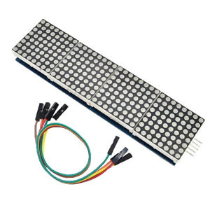

# bitcoinTicker

A bitcoin price ticker I made using JSON, Python and a RPI2. It is displayed on a 8x32 dotmatrix display.

→ [Live Example](https://www.reddit.com/r/raspberry_pi/comments/i0cyoz/im_sure_someone_has_done_something_similar_to/)

## Dependencies: 

* luma.led_matrix
* rm-hull/bitcoin-bar was helpful in this creation

## Display: 

8x32 dotmatrix display

  

## Usage:

Intro to webscraping. It's a pretty simple program. All it does is create the device, makes a request to the website which is in json format, loads in the data, and picks what to show on the dotmatrix. You could also redirect it to a file.

## License

Licensed under the GPL - see the [LICENSE](LICENSE.md) for details.
